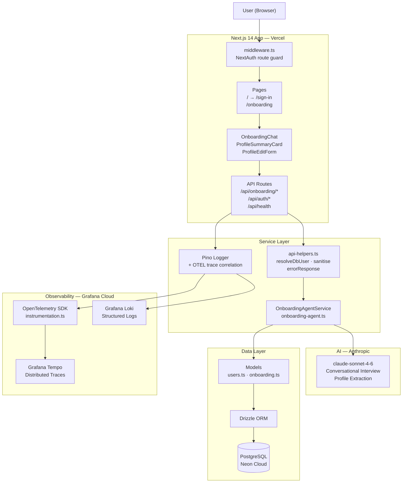
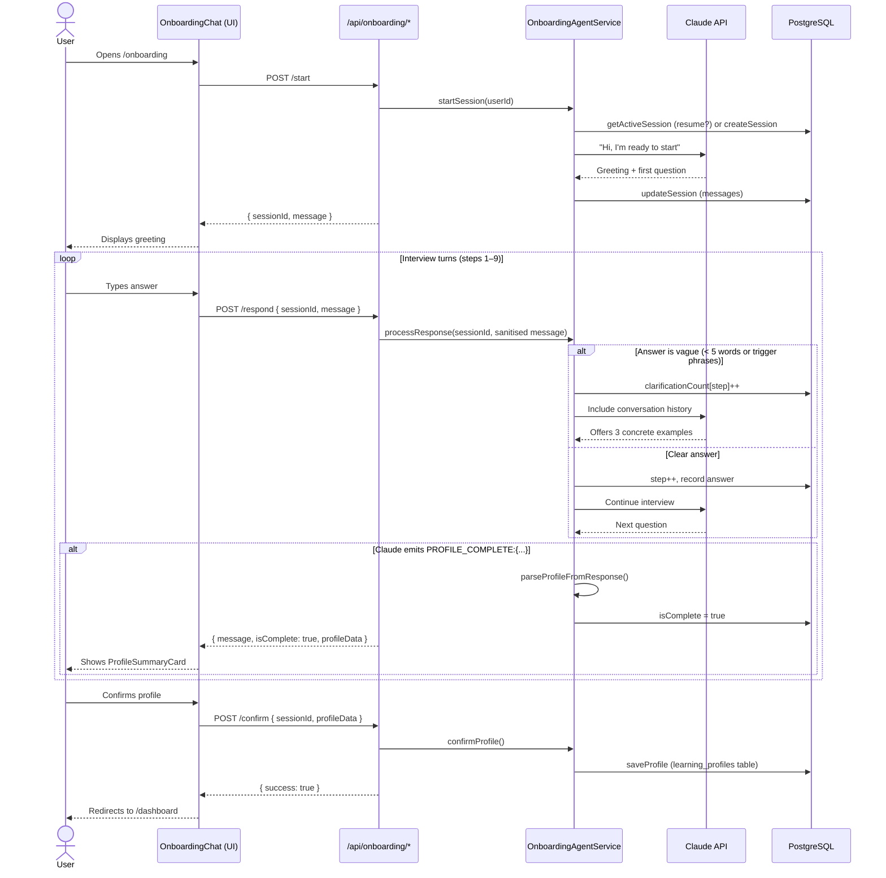
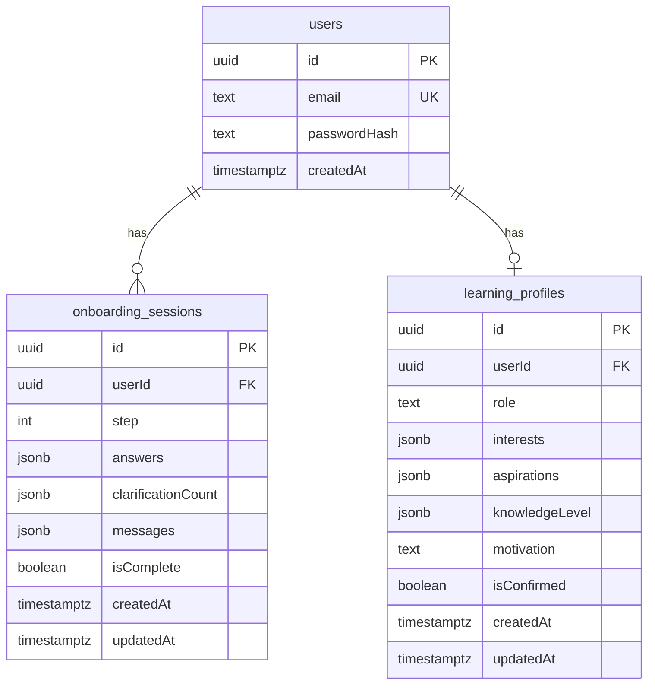
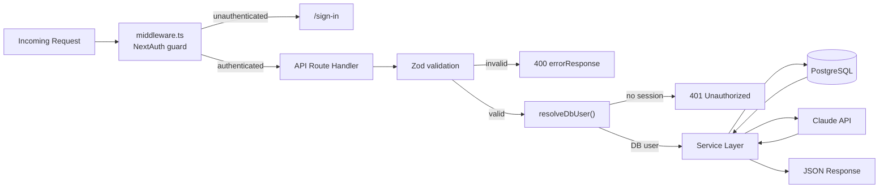
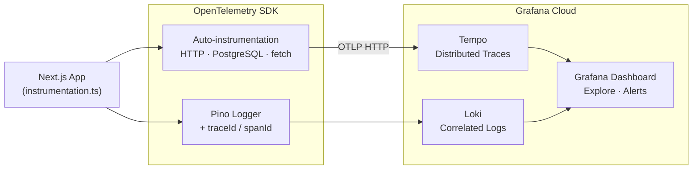

# Stickler

> An agentic learning platform that scans blogs across the web, builds your personalised reading calendar, and tracks your knowledge growth over time.

---

## What It Does

Stickler interviews you to understand your professional role, interests, and learning goals. It then finds the best blog posts for you every 3 days, summarises them into digestible shorts, quizzes you for retention, and benchmarks your knowledge growth month over month — all powered by Claude AI.

---

## Feature Roadmap

| # | Feature | Status |
|---|---|---|
| 1 | Agentic Onboarding Interview — builds your learning profile | **Done** |
| 2 | Blog Discovery & Reading Calendar | Planned |
| 3 | Blog Summarisation, Keywords & Learning Shorts | Planned |
| 4 | Blog Q&A and Feedback Loop | Planned |
| 5 | Recurring Learn Workflow (every 3 days) | Planned |
| 6 | Monthly Knowledge Assessment & Benchmarking | Planned |

---

## System Architecture



---

## Onboarding Interview Flow



---

## Data Model



---

## Request Lifecycle



---

## Observability Architecture



---

## Project Structure

```
stickler_app/
├── app/
│   ├── api/
│   │   ├── auth/           → register, NextAuth handlers
│   │   ├── health/         → liveness + DB readiness
│   │   └── onboarding/     → start · respond · confirm · profile
│   ├── onboarding/         → interview page (server + client)
│   ├── sign-in/            → auth pages
│   └── sign-up/
├── src/
│   ├── services/
│   │   └── onboarding-agent.ts   → Claude state machine
│   ├── models/
│   │   ├── users.ts              → user DB queries
│   │   └── onboarding.ts         → session + profile DB queries
│   ├── components/
│   │   ├── OnboardingChat.tsx
│   │   ├── ProfileSummaryCard.tsx
│   │   └── ProfileEditForm.tsx
│   ├── utils/
│   │   ├── api-helpers.ts        → resolveDbUser, sanitise, errorResponse
│   │   ├── logger.ts             → Pino + OTEL correlation
│   │   ├── telemetry.ts          → OpenTelemetry SDK boot
│   │   └── password.ts           → bcrypt helpers
│   └── types/
│       └── onboarding.ts         → shared TypeScript types
├── db/
│   ├── schema.ts                 → Drizzle schema (3 tables)
│   └── index.ts                  → postgres client
├── SPECS/
│   ├── active/                   → feature being built now
│   ├── planned/                  → specs 2–6
│   └── done/                     → completed specs
├── instrumentation.ts            → Next.js OTEL hook
├── middleware.ts                 → NextAuth route protection
└── CLAUDE.md                     → AI coding instructions
```

---

## Tech Stack

| Layer | Choice | Reason |
|---|---|---|
| Frontend | Next.js 14, Tailwind CSS | App Router, server components |
| Auth | NextAuth.js v5 | Open source, credentials + JWT |
| AI | Anthropic Claude (`claude-sonnet-4-6`) | Agentic interview + profile extraction |
| Database | PostgreSQL via Neon | Serverless, free tier |
| ORM | Drizzle ORM | Type-safe, lightweight |
| Validation | Zod | Runtime schema validation |
| Logging | Pino | Structured JSON, fast |
| Observability | OpenTelemetry + Grafana Cloud | Open source, vendor-neutral |
| Testing | Vitest + Playwright | Unit + E2E |
| Package manager | npm | Default |

---

## Getting Started

### Prerequisites

- Node.js 20+
- A PostgreSQL database (Neon free tier works)
- Anthropic API key

### Setup

```bash
# 1. Install dependencies
npm install

# 2. Copy env file and fill in values
cp .env.example .env.local

# 3. Run database migrations
npm run db:generate
npm run db:migrate

# 4. Start development server
npm run dev
```

Open [http://localhost:3000](http://localhost:3000) — you'll be redirected to sign up and through the onboarding interview.

### Environment Variables

```bash
# Required
DATABASE_URL=             # PostgreSQL connection string
NEXTAUTH_SECRET=          # Random secret (openssl rand -base64 32)
NEXTAUTH_URL=             # http://localhost:3000 in dev
ANTHROPIC_API_KEY=        # From console.anthropic.com

# Optional — OpenTelemetry (Grafana Cloud / SigNoz / Jaeger)
OTEL_SERVICE_NAME=stickler
OTEL_EXPORTER_OTLP_ENDPOINT=
OTEL_EXPORTER_OTLP_HEADERS=
```

### Commands

```bash
npm run dev           # Start dev server
npm run build         # Production build
npm run lint          # ESLint
npm run test          # Vitest unit tests
npm run test:watch    # Vitest watch mode
npm run test:e2e      # Playwright E2E tests
npm run db:generate   # Generate migration from schema changes
npm run db:migrate    # Apply pending migrations
npm run db:studio     # Open Drizzle Studio (DB GUI)
```

Run a single unit test:
```bash
npx vitest run tests/unit/onboarding-agent.test.ts
```

---

## Health Check

```bash
curl http://localhost:3000/api/health
# { "status": "ok", "db": "ok", "ts": "2026-03-25T..." }
```

Returns `503` if the database is unreachable.

---

## Security

- All routes protected by NextAuth middleware — unauthenticated requests redirect to `/sign-in`
- All API inputs validated with Zod before reaching service layer
- Free-text inputs sanitised (HTML stripped) before passing to Claude
- Passwords hashed with bcrypt (12 salt rounds)
- No PII written to OpenTelemetry spans
- OTEL endpoint and auth headers configured via env vars only
